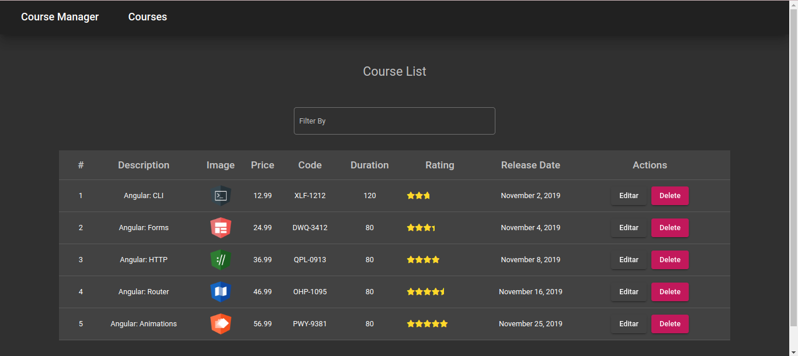
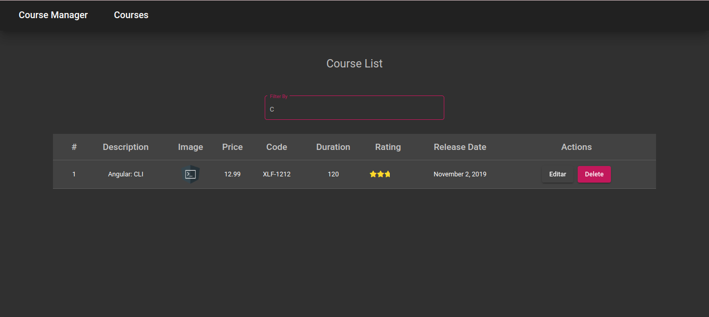
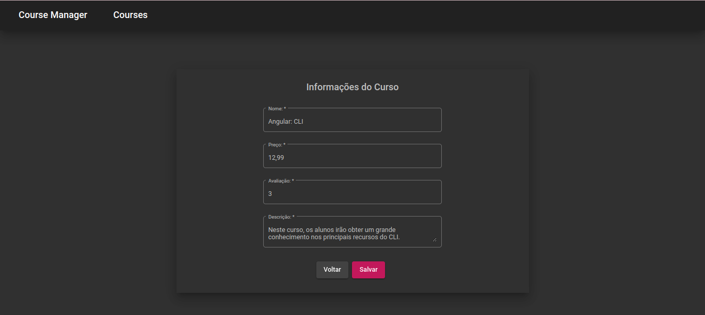

# course-manager

### Project Scope

Creation of a course management system in Angular where you can edit and delete them. The data is mocked on a nodejs server.

### Project Images 

#### Course List

  

#### Filtering Table

  

#### Edit

  

### Instructions

In the back folder, install the packages with the command: npm install.
Too run the server: node server.js.

In the front folder, install the packages with the command: npm install.
To run Angular: ng serve -o<

##### ©Dio 2022 - Bianca Klein Schmitt
